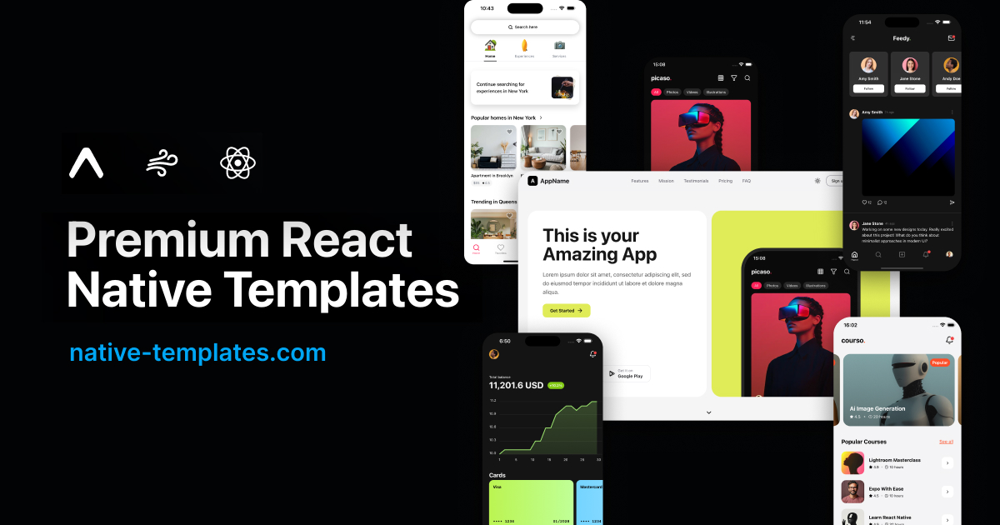

# Thomino's playground
Get full Expo app templates on https://www.native-templates.com

<a href="https://www.native-templates.com" target="_blank">
  
</a>


## Getting Started
Just playing with react native and expo. Feel free to use anything anywhere

```bash
# Use Node.js v20
nvm use 20

# Install dependencies
npm install

# Start the Expo development server with a clean cache
npx expo start -c
```

## Features

- Light/dark theme support
- Masonry grid
- Onboarding slider
- Counter card
- Video expandable card
- Will be adding many more on the go


## License

MIT 